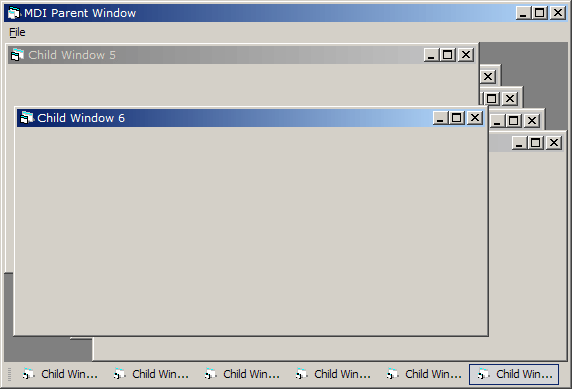



## Custom Taskbar

### Description

Example of making your own taskbar in an MDI application. Has the Office XP look a little bit. If you ever use this code in your own program I'd like to know :) Please leave your feedback.
 
### More Info
 

             |
---                |---
**Submitted On**   |2002-01-01 17:02:52
**By**             |[vcv](https://github.com/Planet-Source-Code/PSCIndex/blob/master/ByAuthor/vcv.md)
**Level**          |Intermediate
**User Rating**    |4.9 (39 globes from 8 users)
**Compatibility**  |VB 4\.0 \(32\-bit\), VB 5\.0, VB 6\.0
**Category**       |[Graphics](https://github.com/Planet-Source-Code/PSCIndex/blob/master/ByCategory/graphics__1-46.md)
**World**          |[Visual Basic](https://github.com/Planet-Source-Code/PSCIndex/blob/master/ByWorld/visual-basic.md)
**Archive File**   |[Custom\_Tas45585112002\.zip](https://github.com/Planet-Source-Code/vcv-custom-taskbar__1-30287/archive/master.zip)

